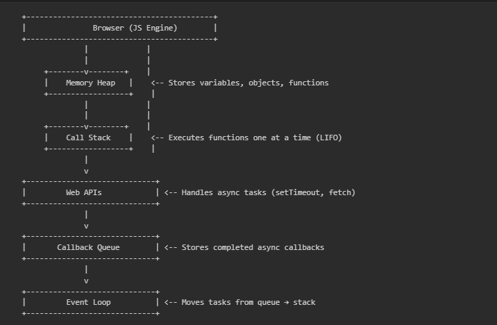

# 🟨 JavaScript Introduction

Welcome to the **JavaScript Introduction** section of the study repository.  
This document covers the basic concepts, history, and working of JavaScript — the most essential language for web development.

---

## 🧩 1. What is JavaScript?

**JavaScript (JS)** is a high-level, interpreted programming language primarily used to make web pages interactive and dynamic.  
It allows developers to implement complex features like updating content, validating forms, animations, and handling user interactions.

- It is a **client-side scripting language** (runs in the browser).  
- Can also be used on the **server side** using **Node.js**.  
- Works alongside **HTML** and **CSS** to create complete web applications.

> 🧠 In simple terms: HTML builds structure, CSS styles it, and JavaScript adds life to it.

---

## 🏛️ 2. History and Evolution of JavaScript

- **1995:** Created by *Brendan Eich* at *Netscape Communications* in just **10 days**.  
- Initially named **Mocha**, then **LiveScript**, and finally renamed **JavaScript** to align with Java’s popularity at that time.  
- **1996:** Microsoft introduced its own version called **JScript**.  
- **1997:** Standardized by **ECMA International** as **ECMAScript (ES)**.  
- **2009:** Introduction of **Node.js**, allowing JavaScript to run outside browsers.  
- **2015:** **ECMAScript 6 (ES6)** was released — a major update that added features like `let`, `const`, arrow functions, classes, modules, etc.

> 🔹 Today, JavaScript is one of the most widely used languages for full-stack development.

---

## ⚙️ 3. Features of JavaScript

- **Lightweight & Fast** – Interpreted directly by the browser without compilation.  
- **Object-Oriented** – Uses prototypes and objects for reusability.  
- **Event-Driven** – Executes code in response to user or system events.  
- **Platform Independent** – Runs on any device or OS with a compatible browser.  
- **Dynamic Typing** – No need to declare variable types explicitly.  
- **Functional & Object-Oriented Paradigms** – Supports both styles of programming.  
- **Rich Libraries & Frameworks** – Includes tools like React, Vue, and Node.js.

---

## ⚖️ 4. Advantages and Disadvantages of JavaScript

### ✅ Advantages
- Increases interactivity and improves user experience.  
- Reduces server load by handling validation and UI logic on the client side.  
- Widely supported by all major browsers.  
- Can be used for both **frontend** (React, Vue) and **backend** (Node.js).  
- Large community and extensive ecosystem.

### ❌ Disadvantages
- Code is visible to users (not secure for sensitive operations).  
- Different browsers may interpret code slightly differently.  
- DOM manipulation can be slow for large-scale applications.  
- Heavily depends on users having JavaScript enabled.

---

## ⚙️ 5. How Does JavaScript Work?

JavaScript runs inside the browser engine (like **V8** in Chrome) and follows this process:

1. **Parsing:** The browser reads and interprets the JS code.  
2. **Execution:** Code is compiled Just-In-Time (JIT) and executed line by line.  
3. **Memory Management:** Data is stored in the **Heap**, and execution happens in the **Call Stack**.  
4. **Event Handling:** Asynchronous operations (like `setTimeout`, API calls) are handled using **Web APIs**, **Callback Queue**, and the **Event Loop**.

---

### 🧠 JavaScript Runtime Architecture

Here’s a diagram showing how JavaScript executes code in the browser:



> ⚙️ The **Event Loop** constantly checks if the Call Stack is empty.  
> When it is, it moves tasks from the Callback Queue into the Call Stack for execution — making JS non-blocking and asynchronous.

---

## ✍️ 6. Basic JavaScript Syntax

JavaScript syntax defines the rules for writing JS code.

```javascript
// Single-line comment

/*
 Multi-line comment
*/

// Variable declaration
let name = "Utsav";
const age = 21;

// Function declaration
function greet(user) {
  return `Hello, ${user}!`;
}

console.log(greet(name)); // Output: Hello, Utsav!
````

---

## 🧱 7. Structure of a JavaScript Program

A simple JS program structure includes:

```javascript
// Step 1: Variable Declaration
let a = 10;
let b = 5;

// Step 2: Function Definition
function add(x, y) {
  return x + y;
}

// Step 3: Function Call and Output
let result = add(a, b);
console.log("Sum:", result);
```

Or embedded in HTML:

```html
<!DOCTYPE html>
<html>
<head>
  <title>JS Example</title>
</head>
<body>
  <h2 id="msg">Hello!</h2>

  <script>
    document.getElementById("msg").innerText = "Hello from JavaScript!";
  </script>
</body>
</html>
```

---

## 💡 Summary

JavaScript is the foundation of modern web development.
It allows developers to build fast, interactive, and dynamic websites.
Understanding its basics — syntax, working, and history — sets the stage for mastering advanced topics like **ES6**, **DOM manipulation**, and **asynchronous programming**.

---

⭐ **Author:** [Utsav Vachhani](https://github.com/utsavvachhani)
📘 **Part of:** [JS Study](../../JS-STUDY/) | [React Study](../../REACT-STUDY) | [Node Study](../../NODE-STUDY)