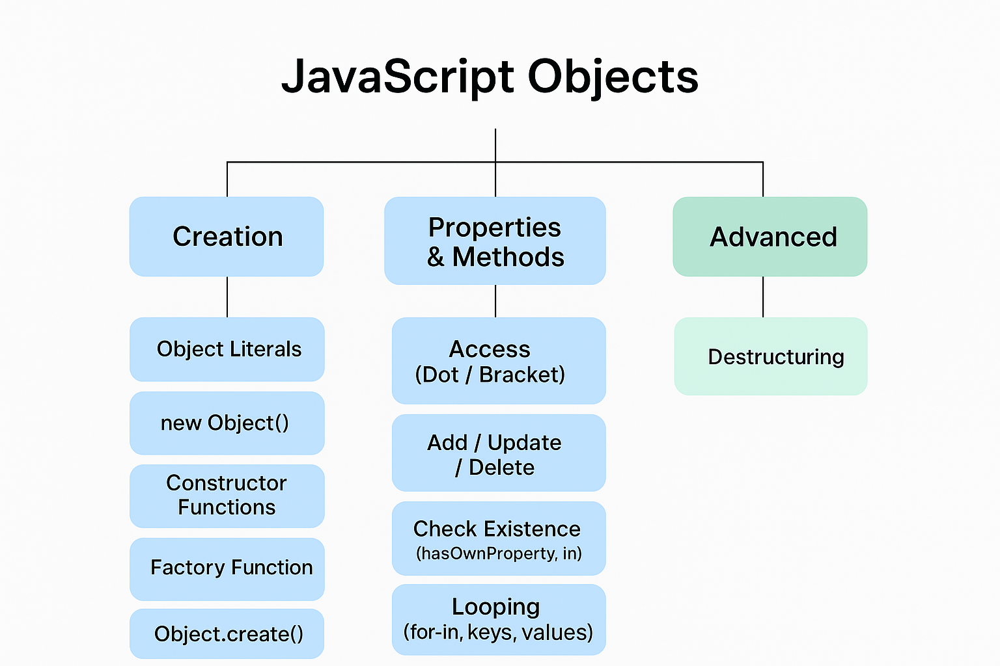

# 🟩 6. JavaScript Objects

Objects are **collections of key-value pairs** in JavaScript. They are fundamental to represent real-world entities and store structured data.  
This section covers object creation, properties, methods, and advanced concepts like destructuring.

---

## 🔹 1. Introduction to Objects

- Objects store **related data** in the form of **properties** and **methods**.  
- Properties → Values associated with the object.  
- Methods → Functions defined inside the object.

```js
const person = {
  name: "Utsav",
  age: 21,
  greet: function() {
    console.log(`Hello, I am ${this.name}`);
  }
};
person.greet(); // Hello, I am Utsav
````



---

## 🔹 2. Object Literals

The simplest way to create objects using `{}`.

```js
const car = {
  brand: "Tesla",
  model: "Model 3",
  year: 2023
};
```

---

## 🔹 3. Object Properties

* Key-value pairs stored in objects.
* Accessed via **dot notation** or **bracket notation**.

```js
console.log(car.brand);       // Tesla
console.log(car["model"]);    // Model 3
```

---

## 🔹 4. Object Methods

Functions defined inside objects.

```js
const person = {
  name: "Utsav",
  greet: function() {
    console.log(`Hi, I am ${this.name}`);
  }
};
person.greet(); // Hi, I am Utsav
```

---

## 🔹 5. Creating Objects

### a) Using `new Object()`

```js
const obj = new Object();
obj.name = "Utsav";
obj.age = 21;
```

### b) Constructor Functions

```js
function Person(name, age) {
  this.name = name;
  this.age = age;
  this.greet = function() {
    console.log(`Hello, I am ${this.name}`);
  };
}

const p1 = new Person("Utsav", 21);
p1.greet(); // Hello, I am Utsav
```

### c) Factory Functions

```js
function createPerson(name, age) {
  return {
    name,
    age,
    greet() { console.log(`Hi, I am ${name}`); }
  };
}

const p2 = createPerson("Meet", 22);
p2.greet(); // Hi, I am Meet
```

### d) `Object.create()`

```js
const proto = {
  greet() { console.log(`Hello!`); }
};

const obj = Object.create(proto);
obj.greet(); // Hello!
```

---

## 🔹 6. Accessing Object Properties

* **Dot notation:** `object.key`
* **Bracket notation:** `object["key"]` (useful for dynamic keys)

```js
const key = "name";
console.log(person[key]); // Utsav
```

---

## 🔹 7. Adding New Properties

```js
person.city = "Ahmedabad";
person["country"] = "India";
```

---

## 🔹 8. Updating Property Values

```js
person.age = 22;
```

---

## 🔹 9. Deleting Properties

```js
delete person.city;
```

---

## 🔹 10. Checking Property Existence

* `hasOwnProperty()`

```js
console.log(person.hasOwnProperty("name")); // true
```

* `in` operator

```js
console.log("age" in person); // true
```

---

## 🔹 11. Looping through Object Properties

### a) `for...in` loop

```js
for (let key in person) {
  console.log(key + ": " + person[key]);
}
```

### b) `Object.keys()`

```js
console.log(Object.keys(person)); // ["name", "age", "greet"]
```

### c) `Object.values()`

```js
console.log(Object.values(person)); // ["Utsav", 22, ƒ]
```

### d) `Object.entries()`

```js
console.log(Object.entries(person));
// [["name", "Utsav"], ["age", 22], ["greet", ƒ]]
```

---

## 🔹 12. Object Destructuring (V IMP)

Extract values from objects into **individual variables**.

```js
const student = { name: "Utsav", age: 21, course: "JS" };
const { name, age, course } = student;

console.log(name);   // Utsav
console.log(age);    // 21
console.log(course); // JS
```

* Can also assign default values and rename variables:

```js
const { name: studentName, age, grade = "A" } = student;
console.log(studentName, grade); // Utsav A
```

---

## 🧩 Summary Diagram

```
JavaScript Objects
│
├── Creation
│   ├── Object Literals
│   ├── new Object()
│   ├── Constructor Functions
│   ├── Factory Functions
│   └── Object.create()
│
├── Properties & Methods
│   ├── Access (Dot / Bracket)
│   ├── Add / Update / Delete
│   ├── Check Existence (hasOwnProperty, in)
│   └── Looping (for-in, keys, values, entries)
│
└── Advanced
    └── Destructuring
```

---

⭐ **Author:** [Utsav Vachhani](https://github.com/utsavvachhani)
📘 **Part of:** [JS Study](../) | [React Study](../../REACT-STUDY) | [Node Study](../../NODE-STUDY)
